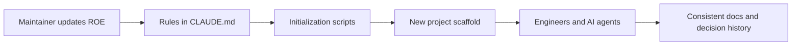
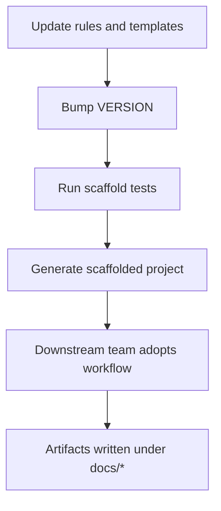

# Architecture Overview - ROE

| Status   | Date       | Project Version |
|----------|------------|-----------------|
| Active   | 2026-05-08 | 1.0.1           |

This document describes the repository architecture for ROE (Rules Of Engagement for Development), including how files, scripts, and documentation work together to initialize and govern downstream projects.

## Scope

ROE is a meta-project. It does not build a runtime product. It defines repeatable rules, templates, and automation that other projects inherit.

## Architecture Goals

- Preserve engineering intent over long timelines.
- Keep process lightweight and executable from the command line.
- Ensure AI assistants load one authoritative rule set.
- Provide a predictable docs structure for every initialized project.

## System Context

## Repository Building Blocks

### 1) Governance Layer

- `CLAUDE.md`: Source of truth for process and documentation rules.
- `AGENTS.md` and `.github/copilot-instructions.md`: Redirect agent behavior to `CLAUDE.md`.
- `VERSION`: Semantic version for the ROE framework itself.

### 2) Scaffolding Layer

- `scripts/initialize-new-project.sh`: Creates the baseline project layout and rule files.
- `scripts/apply-to-existing-project.sh`: Applies ROE conventions to an existing repository.
- `scripts/rules.sh`: Shared shell logic used by scaffolding scripts.

### 3) Verification Layer

- `tests/test-scaffold.sh`: Validates scaffold output and expected file layout.
- `tests/test-output/`: Generated examples used as a reference artifact.

### 4) Documentation Layer

- `docs/adr/`: Architecture Decision Records.
- `docs/code-review/`: Immutable review-cycle records.
- `docs/roadmap/`: Planned features and future work.
- `docs/hldd/`, `docs/job-aid/`, `docs/performance/`, `docs/workflow/`: Additional structured knowledge areas.

## Internal Flow

## Key Decisions in This Architecture

- Single source of truth for agent rules reduces drift across AI tools.
- Numeric sequencing in `docs/` subdirectories makes document order explicit and stable.
- Script-first onboarding lowers setup variance between projects.
- Tests verify scaffold behavior before changes are released.

## Constraints and Assumptions

- Shell scripts target environments with Bash support.
- ROE focuses on structure and process, not language-specific build systems.
- Documentation quality depends on teams consistently using the provided structure.

## Change Management

- Rule changes are made in `CLAUDE.md` and propagated by scaffold scripts.
- Version updates in `VERSION` indicate expected downstream impact.
- Major process changes should be captured as ADRs under `docs/adr/`.

## Non-Goals

- Defining application runtime architecture for downstream products.
- Enforcing a specific programming language, CI platform, or deployment model.

