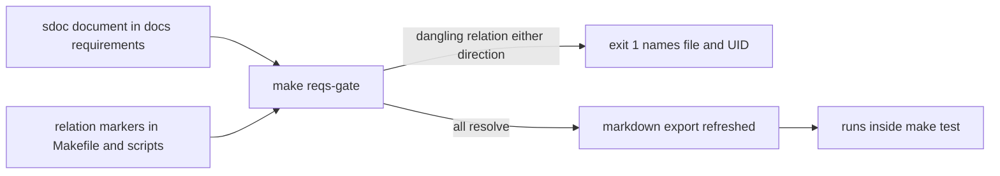

# ADR 007 — Adopt StrictDoc for Requirements Management

| Status | Date       | Project Version |
|--------|------------|-----------------|
| Draft  | 2026-08-28 | 1.0.0           |

## Context

ROE's own requirements lived in `PROJECT_REQUIREMENTS.md` at the repo root: four lines of prose governing `make deploy PROJECT_NAME`, including a safety rule that deploy must never overwrite a file already in the destination project (ADR 006). Nothing re-checked those lines against `scripts/deploy-project.sh` after the day they were written — a future refactor could silently drop the no-overwrite guard and nothing would fail.

The wingman project (a sibling repository under this same parent folder) hit exactly this failure mode with its own safety rules and adopted StrictDoc to fix it: its `docs/adr/066-strictdoc-requirements-adoption.md` records the decision, `docs/research/002-strictdoc-requirements-management-spike.md` is the verified spike that recommended it, and `docs/research/004-strictdoc-benefits-plain-language.md` restates the case in plain language with a coverage table. That third document is the reference this ADR follows; [Research 001](../research/001-strictdoc-benefits-plain-language.md) in this repository adapts it to ROE's own, smaller scope.

`AGENTS.md` currently documents `docs/requirements/` as a plain numbered markdown folder, with no source traceability. This ADR changes that convention going forward.

## Decision

Adopt StrictDoc, pinned to `strictdoc==0.27.1` (a 0.x tool — do not float, per wingman's spike risk assessment), invoked via `uvx --from strictdoc==0.27.1` rather than as a project dependency. ROE has no Python packaging today and no reason to add one just to pin a tool version; `uvx` gives the same pin without introducing a `pyproject.toml`.

Phase 1 scope: one document, four requirements, three source markers.

| Artifact | Content |
|---|---|
| `strictdoc_config.py` | Project config: source traceability over `scripts/*.sh` and `Makefile`; document discovery scoped to `docs/requirements/*.sdoc` |
| `docs/requirements/001-deploy.sdoc` | `DEPLOY-001..004` — the four `PROJECT_REQUIREMENTS.md` lines, converted, each rationale citing ADR 006 |
| `docs/requirements/001-deploy.md` | Committed markdown export for GitHub readers, regenerated by `make reqs` |
| `make reqs-gate` | Validates both directions of the relation graph, exit 1 on any dangling reference; now runs inside `make test` |
| `make reqs` | Runs `reqs-gate`, then refreshes the committed markdown export |
| Relation markers | Three `@relation(UID, scope=line)` comment markers: two in `scripts/deploy-project.sh`, one in the Makefile `deploy` target |

Requirements state the property only; the referenced ADR carries the rationale. `PROJECT_REQUIREMENTS.md` is removed — one home per fact.

## Consequences

- The four `make deploy` properties, including the no-overwrite safety rule, are now re-checked on every `make test`, not read once and forgotten. Renaming or deleting the marked lines in `scripts/deploy-project.sh` or the Makefile without moving the matching `@relation` marker fails the build and names the file and the UID.
- The gate checks *wiring*, not *wording*: rewording a requirement's `STATEMENT` while keeping its UID and its marker in place passes silently. Human review of the requirement text is still required.
- `docs/requirements/` changes convention: a `.sdoc` file is now the source of truth, with a committed `.md` export beside it, rather than hand-written markdown directly. `AGENTS.md`'s "Requirements Documents" section is updated to describe this.
- `make test` now needs network access the first time it runs, to let `uvx` download and cache `strictdoc==0.27.1`; later runs use the local `uv` cache and add roughly two seconds.
- Two authoring conventions bind future ROE requirements written this way: measurable statements only, and no duplicating the referenced ADR's rationale in the requirement text.
- StrictDoc's generic (non-Python) source reader has no `scope=function` marker for shell or Makefile targets — there is no AST-based function-boundary detection for those languages, only `scope=file`, `scope=line`, and `scope=range_start`/`scope=range_end`. ROE's markers use `scope=line`, placed as a trailing comment on the exact line implementing each requirement.

## Implementation Notes

- `strictdoc_config.py` at the repo root defines `create_config()`, matching wingman's pattern; `strictdoc` auto-discovers it when invoked against the repo root.
- Verified positive: `make reqs` exports cleanly, exit 0, and regenerates `docs/requirements/001-deploy.md` from the `.sdoc` source.
- Verified negative, both failure directions, live and reverted immediately after confirming failure — not assumed:
  - A source marker changed to reference a nonexistent UID (`DEPLOY-999` in `scripts/deploy-project.sh`) failed export with exit 1: `error: Source file scripts/deploy-project.sh references a requirement that does not exist: DEPLOY-999.`
  - A dangling `Parent` relation added to `docs/requirements/001-deploy.sdoc` (pointing at `DEPLOY-999`) failed the same way.
- Add `docs/requirements/*.sdoc` and their markdown exports to the deploy template (`tests/test-output/ROE_TEMPLATE_PROJECT` generation) so downstream projects adopting ROE via `make deploy` inherit the same convention, once a downstream project has requirements of its own to convert. Not part of this ADR's Phase 1 scope.

## Open items

- Accepted status requires user review of the four requirement statements in `docs/requirements/001-deploy.sdoc`, plus a green `make test` demonstrating the gate in the bundle (already demonstrated during implementation of this ADR).
