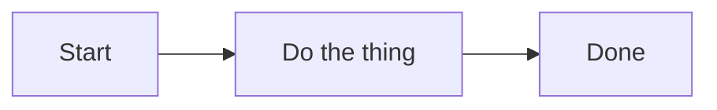

# Job Aid 001 — How to Use ROE

| Status   | Date       | Project Version |
|----------|------------|-----------------|
| Draft    | 2026-05-09 | 1.0.1           |

ROE (Rules Of Engagement) is a documentation and collaboration scaffold that applies consistent structure to any project — firmware, software, hardware, or otherwise. It is AI-native: the rules in `CLAUDE.md` are written so an AI agent (Claude Code, Copilot, or similar) can enforce and follow them without human reminders.

---

## Apply ROE to a New Project

```bash
bash scripts/initialize-new-project.sh <project-name>
```

This copies the scaffold into `../<project-name>/`, creating:

- `CLAUDE.md` — canonical rules read by AI agents
- `.github/copilot-instructions.md` — Copilot summary
- `docs/` subdirectories (empty, ready for use)
- `Makefile` with short-form git targets
- `VERSION` file

Test the output before committing:

```bash
bash scripts/initialize-new-project.sh test-project
ls ../test-project
rm -rf ../test-project
```

---

## Apply ROE to an Existing Project

The `scripts/apply-to-existing-project.sh` script is in progress (see inline comments for current status). For manual adoption:

1. Copy `CLAUDE.md` into the project root.
2. Create the `docs/` folder structure (`adr/`, `job-aid/`, `roadmap/`, `code-review/`, `requirements/`, `performance/`).
3. Retrofit pre-existing decisions as retroactive ADRs (use `Accepted` status).
4. Copy the `Makefile` if the project does not have one, or merge the targets manually.
5. Add `roe.config.json` to the root to tune agent behaviors (see Configuration below).

---

## Daily Makefile Targets

| Target | What it does |
|--------|-------------|
| `make s` | `git status` |
| `make d` | `git diff` (unstaged) |
| `make c` | Stage all + commit `"clean up"` |
| `make n` | Stage all + commit `"new feature"` |
| `make t` | Stage all + commit `"temporary commit"` |
| `make f` | Stage all + fixup commit against HEAD |
| `make p` | Stage all + commit `"wip"` + push |
| `make p "message"` | Stage all + commit with custom message + push |
| `make squash` | Interactive rebase with autosquash against `origin/main` |
| `make test` | Run `tests/test-scaffold.sh` |
| `make r` | Re-initialize project (prompts for name), then runs tests |

---

## Document Types and Where They Live

| Type | Folder | Naming pattern |
|------|--------|----------------|
| Architecture Decision Record | `docs/adr/` | `001-decision-title.md` |
| Job Aid | `docs/job-aid/` | `001-topic.md` |
| Roadmap entry | `docs/roadmap/` | `001-feature-name.md` |
| Code review | `docs/code-review/` | `001-YYYY-MM.md` |
| Requirements | `docs/requirements/` | `001-requirement-name.md` |
| Performance notes | `docs/performance/` | `001-topic.md` |

All documents use zero-padded three-digit prefixes. See Sequential Numbering below.

---

## Sequential Numbering

Every file under any `docs/` subdirectory must start with a zero-padded three-digit number:

```
001-my-document.md
002-another-document.md
```

**Before creating a new file:** use the Glob tool (not shell commands) to list existing files in the target folder, find the highest number, and increment by 1. Never guess — gaps and collisions break the sequence across sessions.

---

## Document Heading Format

Every new document begins with a title and a status table:

```markdown
# <Document Type NNN> — <Title>

| Status   | Date       | Project Version |
|----------|------------|-----------------|
| Draft    | YYYY-MM-DD | See VERSION     |
```

- Read the version from the `VERSION` file at the repo root — never hard-code it.
- Use today's actual date.
- Status values:

| Status | When to use |
|--------|-------------|
| `Draft` | New document not yet reviewed |
| `Active` | Reviewed and in effect (job aids, roadmap, requirements) |
| `Accepted` | ADRs — use this from the moment the ADR is written |
| `Cancelled` | Roadmap entry that will not be built |
| `Obsolete` | Requirements no longer in effect |

---

## ADR Workflow

An ADR records a decision that was made — it is not a proposal. Write it after the decision, not before.

1. Glob `docs/adr/` to find the next number.
2. Create `docs/adr/NNN-short-title.md` with status `Accepted`.
3. Include: **Context** (why the decision was needed), **Decision** (what was chosen), **Alternatives Considered**, **Consequences**.
4. If a later decision supersedes this one, write a new ADR and reference the old one. Do not modify an `Accepted` ADR.
5. Performance ADRs must include actual measured data — no estimates.

---

## Diagrams

Always use Mermaid. Never use ASCII box-drawing characters or arrow art.

````markdown

````

---

## Configuration File

Add `roe.config.json` to the repo root to tune agent behaviors without modifying `CLAUDE.md`. The file is optional — ROE runs with sensible defaults when absent. All settings can be changed at any time as the project evolves (e.g., flipping `local_project` when a repo goes public).

Key parameters:

| Parameter | Default | Description |
|-----------|---------|-------------|
| `local_project` | `false` | Suppresses remote git operations when `true`. Toggle freely as project visibility changes — no re-scaffolding needed |
| `auto_review_on_adr_create` | `false` | AI review pass when a new ADR is created |
| `auto_implement_adr` | `false` | Prompt agent to draft implementation tasks when an ADR is accepted |
| `require_adr_for_breaking_change` | `false` | Warn when a breaking change has no linked ADR |
| `enforce_sequential_numbering` | `true` | Enforce zero-padded numbering in all `docs/` subdirectories |
| `security_review_on_pr` | `false` | Automatic security review on new PRs |
| `adr_review_model` | `"default"` | Claude model for ADR reviews (`"sonnet"`, `"opus"`, `"haiku"`) |

Minimal example:

```json
{
  "local_project": false,
  "auto_review_on_adr_create": true,
  "enforce_sequential_numbering": true
}
```

---

## Agent Integration

ROE rules are loaded automatically by:

| Agent | File read |
|-------|-----------|
| Claude Code | `CLAUDE.md` |
| GitHub Copilot | `.github/copilot-instructions.md` |

Both files point to the same rules. Do not duplicate rule content in the agent files — summarize and link only. When adding a new AI integration, follow the same pattern.

---

## Rule Changes

- **Minor clarification** (wording, examples): edit `CLAUDE.md` directly.
- **Significant change** (new section, removal, intent change): write an ADR in `docs/adr/` first.
- Rules must be actionable, system-agnostic, and self-contained — no language or toolchain assumptions unless explicitly scoped.
