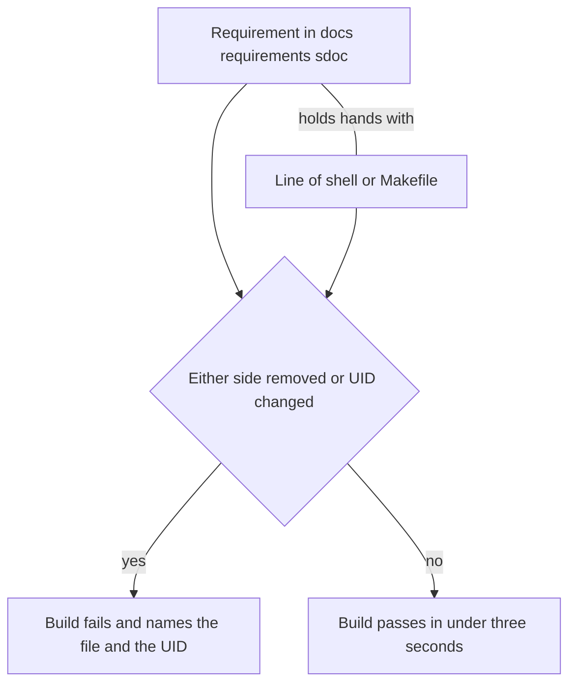

# Research 001 — Why StrictDoc: The Case for Managed Requirements, in Plain Language

| Status   | Date       | Project Version |
|----------|------------|-----------------|
| Draft    | 2026-08-28 | 1.0.0           |

## Question

ADR 007 adopts StrictDoc for ROE's own requirements. What problem does it actually solve here, said simply — and does the protection it promises actually hold up when checked, not just assumed?

## Summary of Findings

**Before StrictDoc, ROE's four `make deploy` requirements were four lines of prose at the repo root, checked once by whoever wrote them and never again.** Now `make test` re-checks that every requirement still points at real code, and breaking that link fails the build by name. This was verified live, both directions, not assumed. One honest note: the gate checks that a rule is still wired to code, not that the wording is still true — a requirement can be reworded incorrectly and still pass.

## The problem, simply

`PROJECT_REQUIREMENTS.md` used to hold four rules for `make deploy PROJECT_NAME` — including a safety rule: deploy must never overwrite a file already in the destination project. That file was a diary entry. It got read on the day it was written, and after that nothing pointed back at it. If a future change to `scripts/deploy-project.sh` quietly dropped the no-overwrite guard — say, someone swaps `cp -an` for a plain `cp -a` while refactoring — nothing would say so. The rule would just stop being true, silently, until someone's real project lost a file.

This is not a new problem. The wingman project hit this exact failure mode with its own safety rules (wingman's ADR 065 documents it happening for real) and adopted StrictDoc to fix it. Its plain-language account of the fix — `docs/research/004-strictdoc-benefits-plain-language.md` in the wingman repository — is the reference this document follows and adapts. ROE's case is smaller (four requirements, not twelve) but the mechanism and the reasoning are the same.

## Benefit 1 — The rules get checked every build, not once

Writing a rule in a markdown file and never re-reading it is like installing a smoke detector and testing the battery only on install day. StrictDoc turns each rule into a requirement with a gate: `make reqs-gate` re-verifies that every requirement still resolves to real code, and it now runs inside `make test`. It costs about two seconds on this project.

## Benefit 2 — The rule and the code hold hands, and letting go sets off an alarm

Each requirement has a UID (`DEPLOY-001` through `DEPLOY-004`). The implementing line of shell or Makefile carries a matching `@relation(UID, scope=line)` comment. If either side is removed without the other, the build fails and names exactly what broke.

This was checked live, not assumed, in both directions:

- A source marker renamed to point at a UID that does not exist (`DEPLOY-999` in `scripts/deploy-project.sh`) failed the export with exit 1: `error: Source file scripts/deploy-project.sh references a requirement that does not exist: DEPLOY-999.`
- A dangling relation added inside the `.sdoc` file itself (a `Parent` relation to `DEPLOY-999`) failed the same way.
- The clean tree exits 0 in under three seconds with all four Makefile and shell source files scanned.

Both edits were reverted immediately after confirming the failure; nothing from the test is left in the working tree.

## Benefit 3 — Each fact is written down exactly once

| Kind of fact | Its one home |
|--------------|--------------|
| The rule itself (what must be true) | The requirement in `docs/requirements/001-deploy.sdoc` |
| Why the rule exists | ADR 006, referenced from each requirement's rationale |
| The exact line that implements it | The `@relation` marker, not a copy of the rule text |

`PROJECT_REQUIREMENTS.md` is removed once the conversion lands — keeping it alongside the `.sdoc` source would recreate the two-copies problem StrictDoc exists to close.

## Benefit 4 — Future rules are forced to be testable

Two conventions carried over from wingman bind every future ROE requirement written this way:

1. **Measurable statements only.** "Deploy shall not overwrite files" is checkable by inspection of `cp -an`; a requirement phrased as "deploy should be careful with files" would not be.
2. **No duplicating the ADR.** The requirement states the property; the linked ADR carries the *why*. This is what keeps Benefit 3 true as the project grows past four requirements.

## The honest caveat

Unlike wingman's twelve requirements — where two had no source marker and relied on human review alone — all four of ROE's current requirements have a marker, so there is no coverage gap to report today. That is a function of the current scope being small, not evidence the mechanism is stronger here. The caveat that does carry over unchanged: the gate checks *wiring*, not *wording*. Renaming or deleting the marked line fails the build; silently rewording a requirement's statement to say something different, while keeping the same UID and the same line, passes silently. Nothing in this mechanism substitutes for a human reading the actual requirement text during review.

## Coverage evidence

| Rule | Marker location |
|------|-----------------|
| DEPLOY-001 | `scripts/deploy-project.sh` — `PROJECTS_DIR` resolution |
| DEPLOY-002 | `Makefile` — `deploy` target's template-existence check |
| DEPLOY-003 | `scripts/deploy-project.sh` — destination-exists check |
| DEPLOY-004 | `scripts/deploy-project.sh` — `cp -an` no-clobber copy |

## Relationship to existing documents

- [ADR 007](../adr/007-adopt-strictdoc-for-requirements-management.md) — the adoption decision this research supports, and the negative-test evidence referenced in Benefit 2.
- [ADR 006](../adr/006-deploy-template-to-sibling-project.md) — the original decision that produced the four requirements converted here.
- The wingman project's `docs/adr/066-strictdoc-requirements-adoption.md`, `docs/research/002-strictdoc-requirements-management-spike.md`, and `docs/research/004-strictdoc-benefits-plain-language.md` — the prior art this project's adoption follows, including the verified spike that first answered whether StrictDoc's traceability claims actually hold up.
